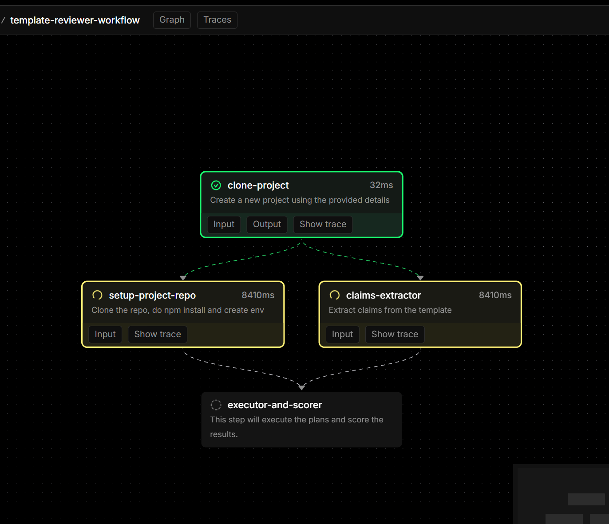

# 🏆 Mastra.Build Hackathon Evaluator

**Automated, unbiased evaluation system for Mastra.Build hackathon submissions using advanced multi-agent workflows.**

🎥 **[Watch Demo Video](https://youtu.be/Di915MLrvDM)** - See the evaluator in action!

This system revolutionizes hackathon judging by replacing subjective manual reviews with **systematic, data-driven evaluation**. Built specifically for the Mastra.Build hackathon, it automatically evaluates submitted projects, validates claimed features through live testing, and provides sponsor-aligned scoring with track eligibility detection.

## 🎯 Core Purpose

**Problem**: Mastra.Build hackathon judging requires evaluating diverse AI agent projects consistently across multiple sponsor prize categories.

**Solution**: An AI-powered evaluation pipeline that:
- **🔍 Extracts verifiable claims** from project documentation and demo videos
- **🧪 Tests functionality** through automated agent interactions  
- **⭐ Scores objectively** using standardized criteria across all submissions
- **🏷️ Tags for sponsor tracks** with automatic eligibility detection for Smithery, WorkOS, Browserbase, Arcade, Chroma, Recall, and Confident AI prizes
- **📊 Ranks submissions** with transparent, auditable results

## 🌟 Why This Matters for Mastra.Build

This system transforms Mastra.Build evaluation from **"subjective demos" to "empirical validation"**:

- **⚖️ Eliminates judging bias** through systematic evaluation criteria
- **🎯 Validates AI agent functionality** instead of relying on presentations alone  
- **🏆 Automatically detects sponsor alignment** for prize categories (MCP servers, auth integration, web browsing, etc.)
- **⚡ Scales to evaluate** hundreds of Mastra framework submissions efficiently
- **📈 Provides detailed feedback** to help Mastra community members improve their agents

## 🚀 Novel Approach: Mastra Evaluating Mastra

**🎯 Revolutionary Insight**: This project demonstrates a groundbreaking approach to AI agent evaluation by **using the Mastra framework to evaluate Mastra-built agents**.

### 🔄 Self-Evaluation Architecture

Rather than building evaluation as a separate framework or external tool, we've created something unprecedented:

- **🤖 Mastra Agents Evaluating Mastra Agents**: The evaluator itself is a sophisticated Mastra multi-agent workflow
- **🔗 Native Framework Integration**: Deep understanding of Mastra patterns, conventions, and architectural decisions
- **📡 Cross-Instance Communication**: Uses official `@mastra/client-js` to programmatically test agents running in separate Mastra instances
- **🧬 Framework-Aware Testing**: Inherent knowledge of Mastra workflows, tools, and agent patterns enables more intelligent evaluation

### 💡 Why This Matters Beyond Hackathons

This **"framework evaluating itself"** approach represents a new paradigm in AI system assessment:

**Traditional Approach** ❌:
```
External Eval Tool → Tests → AI Framework Project
```

**Our Novel Approach** ✅:
```
Mastra Evaluator Agent → Tests → Mastra Target Agent
(Same framework, deep native understanding)
```

### 🎯 Unique Advantages

- **🧠 Native Intelligence**: The evaluator inherently understands Mastra conventions, making evaluations more contextually accurate
- **🔧 Self-Improving Ecosystem**: Insights from evaluations can directly improve the framework itself
- **📊 Framework-Specific Metrics**: Evaluation criteria tailored specifically to Mastra's multi-agent, workflow-oriented architecture
- **🚀 Proof of Concept**: Demonstrates Mastra's capability to build sophisticated, production-ready evaluation systems

> **🎖️ Industry First**: To our knowledge, this is the first time a multi-agent framework has been used to systematically evaluate projects built with itself, showcasing both the maturity and self-reflective capabilities of the Mastra ecosystem.

## 🏆 Sponsor Prize Track Detection

A key differentiator of this evaluation system is **automated sponsor alignment detection**. The AI scorer analyzes project dependencies, functionality, and implementation patterns to identify eligibility for specific sponsor prize categories:

### 📋 Mastra.Build Prize Categories
- **🥇 Best overall** (judged by Mastra)
- **🔧 Best MCP server** (judged by Smithery)
- **⭐ Bonus award: Best use of Smithery** (Switch2)
- **🤖 Best use of AgentNetwork** (judged by Mastra)
- **🔐 Best use of auth** (judged by WorkOS)
- **🌐 Best use of web browsing** (judged by Browserbase)
- **🛠️ Best use of tool provider** (judged by Arcade)
- **📚 Best RAG template** (judged by Chroma)
- **⚡ Best productivity** (judged by Mastra)
- **💻 Best coding agent** (judged by Mastra)
- **💰 Best crypto agent** (judged by Recall)
- **🧪 Best use of Evals** (judged by Confident AI)
- **🎯 Shane's favorite** (judged by Shane)
- **😄 Funniest** (judged by Abhi)

### 🎯 Automated Tag Detection Process

The system automatically analyzes:
- **📦 Package Dependencies**: Detects `@smithery/sdk`, `@workos/node`, `browserbase`, `@arcadeai/arcadejs`, `chromadb`, etc.
- **🔍 Code Patterns**: Identifies authentication flows, web scraping, RAG implementations, MCP server structures
- **📝 Documentation Keywords**: Extracts mentions of sponsor technologies and use cases
- **🧪 Functionality Testing**: Validates actual integration with sponsor services

> **⚠️ Important Note**: This system is designed to **assist and accelerate** the evaluation process, not replace human judgment. While it provides systematic analysis and scoring, **human review remains essential** for final prize decisions, especially for subjective categories like "Shane's favorite" and "Funniest". The AI evaluation serves as a comprehensive first-pass filter and detailed analysis tool for judges.

### 🎯 Key Features
- **⚙️ Environment Variable Injection** - Seamless config propagation from parent to testing playgrounds
- **Dependency Injection** - Leverages InversifyJS for loose coupling and testability
- **Multi-Agent Coordination** - Specialized agents working in orchestrated harmony
- **Template Ready** - A complete Mastra template showcasing advanced patterns

## 🏗️ Architecture

The system uses a multi-agent pipeline with the following specialized components:

### 🤖 Core Agents
- **📋 Template Reviewer Agent** - Main evaluation agent that coordinates the assessment process
- **📚 Documentation Review Agent** - Analyzes project documentation for clarity, completeness, and extracts metadata
- **🎯 Promise Extraction Agent** - Identifies and extracts stated features, claims, and guarantees from documentation
- **🧪 Testing Agent** - Verifies promises through automated testing and validation
- **⭐ Scoring Agent** - Provides final evaluation using a writer-reviewer pattern for high accuracy

### 🔧 Architecture Features
- **🆔 Unique Project ID**: Each evaluation uses a UUID for tracking and correlation
- **📦 Structured Input/Output**: All agents communicate through well-defined Zod schemas
- **🔀 Model Routing**: Uses OpenRouter for optimal LLM selection per task
- **🏷️ Tag Generation**: Automatic keyword extraction for searchability

## 🔄 Template Reviewer Workflow Architecture

The heart of this system is the **template-reviewer-workflow** (`src/mastra/workflows/template-reviewer-workflow/`), a sophisticated multi-step evaluation pipeline that demonstrates advanced workflow orchestration patterns.

### 📋 Workflow Overview

The template reviewer workflow implements a **4-phase evaluation process** with parallel execution where possible:

```typescript
templateReviewerWorkflow = createWorkflow({
  id: "template-reviewer-workflow",
  description: "Coordinator that launches the full template-review workflow",
  inputSchema: templateReviewerWorkflowInputSchema,
  outputSchema: templateReviewerWorkflowOutputSchema,
})
.then(createStep({ id: "clone-project" }))      // Phase 1: Setup
.parallel([                                      // Phase 2: Parallel Analysis
  createStep({ id: "setup-project-repo" }),
  createStep({ id: "claims-extractor" })
])
.then(createStep({ id: "executor-and-scorer" })) // Phase 3: Testing & Scoring
.commit();
```

### 🔧 Core Workflow Components

#### 1. **📊 Project Setup & Cloning**
- Creates new project entity with UUID tracking
- Persists project metadata to database
- Initializes evaluation context with environment configuration

#### 2. **🔍 Claims Extractor** 
**Purpose**: Systematically extracts capabilities claimed by template submitted from project documentation and video transcripts.

Key features:
- **📝 Dual-source analysis**: Processes both documentation and video transcripts
- **🎯 Present-tense filtering**: Distinguishes between current capabilities vs future promises
- **🏷️ Structured extraction**: Outputs standardized claim objects with evidence references

```typescript
export const claimsSchema = z.object({
  claims: z.array(z.object({
    name: z.string().describe("Concise, verb-first summary (≤ 10 words)"),
    description: z.string().describe("Full claim text with ≤ 25-word evidence snippet")
  }))
});
```

**Why it's critical**: Claims extraction forms the foundation for all subsequent testing and evaluation. Without accurate claim identification, the testing phase cannot validate the right functionality.


#### 3. **📋 Plan Maker**
**Purpose**: Generates comprehensive test plans that validate extracted claims through systematic chat-based interactions.

This component is **strategically vital** because it:
- **🎯 Bridges claims to testing**: Converts abstract capability claims into concrete, executable test scenarios
- **📚 Resource-aware planning**: Leverages a curated resource kit (PDFs, CSVs, websites, locations) for realistic testing
- **🔄 Multi-plan generation**: Creates exactly 3 complementary test plans to maximize claim coverage
- **💬 Chat-based validation**: Designs conversational tests that mirror real user interactions

**Resource Kit Integration**:
We understand that sample data must be needed to test out certain agents, we have already taken care of that! This evaluator includes sample data for the following:

- **📄 Document Processing**: Universal Declaration of Human Rights, Sherlock Holmes stories, AI Agent principles Mastra book
- **📊 Data Analysis**: Iris dataset, Penguins dataset, Apple stock data  
- **🌐 Web Content**: Hacker News, Wikipedia pages
- **🌍 Location Data**: Coordinates for weather-related testing

#### 4. **🧪 Tester Component** (`tester.ts`)
**Purpose**: Executes the generated test plans and validates agent responses against success criteria. It uses a multi-pass tester-validator loop to chat with target agent and verify if the target agent does what it claims in its documentation and video demos

```typescript
export const testerOutputSchema = z.array(z.object({
  id: z.string(),           // Links back to plan-1, plan-2, plan-3
  passed: z.boolean(),      // Binary pass/fail result
  explanation: z.string(),  // Detailed reasoning for the result
}));
```

## 🔗 Programmatic Agent Testing with Mastra Client

A key innovation of this evaluation system is its ability to **programmatically control and test agents** running in separate Mastra playground instances. This is accomplished using the official `@mastra/client-js` library, enabling sophisticated cross-instance agent orchestration.

### 🚀 Multi-Instance Testing Architecture

The system operates using a **dual-playground architecture**:

1. **🎯 Evaluator Instance** - Runs the Template Reviewer Workflow (main evaluation agent)
2. **🔬 Target Instance** - Runs the project being evaluated (cloned and deployed automatically)

**Key Innovation**: The evaluator agent can programmatically discover, connect to, and test agents running on completely different Mastra playground instances.

### 📡 Official Mastra Client Integration

The tester component leverages the **official Mastra JavaScript client** (`@mastra/client-js`) for seamless agent communication:

```typescript
import { MastraClient } from "@mastra/client-js";

export async function runPlansAgainstAgent(props: {
  port: string;
  plans: z.infer<typeof planMakerOutputSchema>["plans"];
}) {
  // Connect to target Mastra instance
  const baseUrl = `http://localhost:${props.port}/`;
  const client = new MastraClient({ baseUrl });
  
  // Discover available agents and choose the one with most tools
  const agents = await discoverAgentsWithClient(client);
  // ... rest of testing logic
}
```

### 💬 Threaded Conversation Testing

The system uses **stateful conversation threads** for realistic multi-turn testing:

```typescript
async function sendChatWithClient(
  client: MastraClient,
  agentId: string,
  messages: Messages,
  threadId?: string
): Promise<string> {
  const agent = client.getAgent(agentId);
  const res: any = await agent.generate({ messages, threadId });
  
  // Intelligent response parsing
  if (typeof res === "string") return res;
  if (typeof res.text === "string") return res.text;
  if (typeof res.message === "string") return res.message;
  if (typeof res.content === "string") return res.content;
  
  // Handle message arrays (conversation format)
  if (Array.isArray(res.messages)) {
    const last = res.messages[res.messages.length - 1];
    if (last?.content) return String(last.content);
  }
  
  return JSON.stringify(res);
}
```

### 🎯 Context-Aware Testing Process

The complete testing workflow demonstrates:

1. **🔌 Client Connection** - Establishes connection to target Mastra instance using official client
2. **🤖 Agent Discovery** - Queries available agents and their capabilities via client API
3. **🎯 Smart Selection** - Chooses optimal agent based on name matching or tool count
4. **🧵 Thread Management** - Creates stable conversation threads per test plan for context continuity
5. **💬 Interactive Testing** - Conducts realistic chat-based validation of claimed functionality
6. **📊 Evidence Collection** - Documents complete interaction transcripts for transparent scoring

### 🏆 Why This Approach Matters for Judges

This **professional client-based architecture** demonstrates several key advantages:

#### 🔧 **Official Integration**
- **✅ Standards Compliance**: Uses official Mastra client library, not custom API calls
- **🔄 Future-Proof**: Benefits from official library updates and improvements
- **🛡️ Error Handling**: Robust error handling through established client patterns

#### 🧵 **Stateful Conversations**
- **💬 Realistic Testing**: Multi-turn conversations with proper context preservation
- **🎯 Thread Isolation**: Each test plan maintains its own conversation thread
- **📈 Scalable Design**: Concurrent testing across multiple agent instances

#### 🎯 **Tool-Based Agent Selection**
- **🔧 Tool-Centric**: Always selects the agent with the highest tool count for comprehensive testing
- **📊 Objective Criteria**: Uses quantifiable metrics (tool count) rather than subjective name matching
- **🎯 Optimal Coverage**: Ensures testing against the most capable agent available

This approach showcases **integration patterns** with the Mastra ecosystem, demonstrating how to build sophisticated agent orchestration systems using official tooling rather than ad-hoc API integrations.

#### 5. **⭐ Scorer Component** (`scorer.ts`)
**Purpose**: Provides comprehensive evaluation across multiple dimensions with detailed explanations.

```typescript
export const scorerOutputSchema = z.object({
  descriptionQuality: z.object({ score: z.number().min(1).max(5), explanation: z.string() }),
  tests: testerOutputSchema,  // Integration with test results
  appeal: z.object({ score: z.number().min(1).max(5), explanation: z.string() }),
  creativity: z.object({ score: z.number().min(1).max(5), explanation: z.string() }),
  architecture: z.object({
    agents: z.object({ count: z.number() }),
    tools: z.object({ count: z.number() }),
    workflows: z.object({ count: z.number() }),
  }),
  tags: z.array(z.string()),  // Automatic categorization
});
```

### 🔄 Workflow Execution Flow

1. **📥 Input Processing**: Accepts project name, repository URL, description, video URL, and optional environment configuration
2. **🔄 Parallel Phase**: 
   - **Repo Setup**: Clones repository, runs `npm install`, creates `.env` file
   - **Claims Analysis**: Extracts video transcript, analyzes documentation, identifies capabilities
3. **📋 Plan Generation**: Creates 3 targeted test plans based on extracted claims
4. **🧪 Test Execution**: Runs chat-based tests against the deployed project
5. **⭐ Final Scoring**: Generates comprehensive evaluation with detailed explanations

### 🎯 Why This Architecture Matters

#### **🔍 Systematic Claim Validation**
Unlike ad-hoc evaluation approaches, this workflow ensures **every stated capability** is systematically:
- **📝 Documented** (claims extractor)
- **📋 Planned for testing** (plan maker)  
- **🧪 Empirically validated** (tester)
- **⭐ Scored with evidence** (scorer)

#### **🔄 Reproducible Evaluation Process**
The workflow creates an **audit trail** from initial claims through final scores, enabling:
- **🔍 Traceability**: Every score traces back to specific test results
- **🔄 Reproducibility**: Same project always produces consistent evaluations
- **📊 Comparative Analysis**: Standardized scoring enables project comparisons

#### **⚡ Parallel Processing Optimization**
Smart parallelization reduces evaluation time:
- **Repository setup** and **claims extraction** run concurrently
- **Video processing** happens alongside **documentation analysis**
- **Database persistence** is optimized for workflow state management

## 💡 Real-World Example: Evaluating Deep Research Assistant

Let's walk through how our template reviewer workflow would evaluate the [Deep Research Assistant](https://github.com/mastra-ai/template-deep-research.git) project:

### 📥 Input Processing
```json
{
  "name": "Deep Research Assistant",
  "repoURLOrShorthand": "https://github.com/mastra-ai/template-deep-research.git",
  "description": "Advanced AI deep research assistant with human-in-the-loop workflows",
  "videoURL": "https://youtube.com/watch?v=demo-video",
  "envConfig": {
    "EXA_API_KEY": "demo-key-for-testing"
  }
}
```

### 🔍 Claims Extraction Output
Our claims extractor would identify these present-tense capabilities:

```json
{
  "claims": [
    {
      "name": "Implements interactive human-in-loop research system",
      "description": "Creates an interactive, human-in-the-loop research system that allows users to explore topics - README line 3"
    },
    {
      "name": "Searches web using Exa API integration", 
      "description": "webSearchTool: Searches the web using the Exa API for relevant information - README line 15"
    },
    {
      "name": "Evaluates research result relevance automatically",
      "description": "evaluateResultTool: Assesses result relevance to the research topic - README line 16"
    },
    {
      "name": "Generates comprehensive markdown reports",
      "description": "reportAgent: Transforms research findings into comprehensive markdown reports - README line 20"
    },
    {
      "name": "Extracts key learnings and follow-up questions",
      "description": "extractLearningsTool: Identifies key learnings and generates follow-up questions - README line 17"
    }
  ]
}
```

### 📋 Generated Test Plans
Our plan maker would create 3 targeted **chat-based test plans**:

#### **Plan 1: End-to-End Research Process**
```json
{
  "id": "plan-1",
  "title": "Validate complete research workflow with report generation",
  "claims_targeted": [
    "Searches web using Exa API integration",
    "Generates comprehensive markdown reports"
  ],
  "steps": [
    {
      "message": "I need you to research 'AI agent frameworks in 2024' and provide me with a comprehensive analysis. Please use the Principles of Building AI Agents document at https://hs-47815345.f.hubspotemail.net/hub/47815345/hubfs/book/principles_2nd_edition_updated.pdf as a reference.",
      "expected_agent_behavior": "Should initiate web search using Exa API, retrieve relevant information, and reference the provided PDF"
    },
    {
      "message": "Now generate a final research report in markdown format with your findings.",
      "expected_agent_behavior": "Should produce a well-structured markdown report containing research findings, analysis, and references"
    }
  ],
  "success_criteria": [
    "Successfully searches web using Exa API",
    "References the provided PDF document",
    "Generates properly formatted markdown report",
    "Report contains research findings and analysis"
  ],
  "resourcesToUse": [
    {"name": "AI Agent Principles PDF", "url": "https://hs-47815345.f.hubspotemail.net/hub/47815345/hubfs/book/principles_2nd_edition_updated.pdf"}
  ]
}
```

#### **Plan 2: Result Evaluation and Learning Extraction**
```json
{
  "id": "plan-2", 
  "title": "Test relevance evaluation and learning extraction capabilities",
  "claims_targeted": [
    "Evaluates research result relevance automatically",
    "Extracts key learnings and follow-up questions"
  ],
  "steps": [
    {
      "message": "Research Python programming trends using information from https://en.wikipedia.org/wiki/Python_(programming_language) and evaluate how relevant each piece of information is to modern software development.",
      "expected_agent_behavior": "Should retrieve Wikipedia content, assess relevance of different sections, and provide relevance ratings"
    },
    {
      "message": "Based on your research, extract the top 3 key learnings and suggest 2 follow-up research questions.",
      "expected_agent_behavior": "Should identify key insights from the research and generate relevant follow-up questions for deeper investigation"
    }
  ],
  "success_criteria": [
    "Demonstrates relevance evaluation for search results",
    "Extracts meaningful key learnings from research data",
    "Generates logical follow-up research questions",
    "Shows clear reasoning for relevance assessments"
  ],
  "resourcesToUse": [
    {"name": "Wikipedia Python Page", "url": "https://en.wikipedia.org/wiki/Python_(programming_language)"}
  ]
}
```

#### **Plan 3: Multi-Source Research Integration**
```json
{
  "id": "plan-3",
  "title": "Validate research across multiple data sources and formats",
  "claims_targeted": [
    "Implements interactive human-in-loop research system",
    "Searches web using Exa API integration"
  ],
  "steps": [
    {
      "message": "Research current trends in data science by analyzing information from https://news.ycombinator.com/ and correlating it with data patterns from the Iris dataset at https://raw.githubusercontent.com/mwaskom/seaborn-data/master/iris.csv",
      "expected_agent_behavior": "Should fetch and analyze both web content from Hacker News and CSV data, then find correlations or connections"
    },
    {
      "message": "Summarize how the current discussions on Hacker News relate to data science methodologies, using examples from the Iris dataset analysis.",
      "expected_agent_behavior": "Should synthesize findings from both sources and demonstrate connections between current discussions and classic data science examples"
    }
  ],
  "success_criteria": [
    "Successfully processes both web content and CSV data",
    "Demonstrates integration across multiple data formats", 
    "Provides meaningful synthesis of disparate information sources",
    "Shows ability to correlate web discussions with data analysis"
  ],
  "resourcesToUse": [
    {"name": "Hacker News", "url": "https://news.ycombinator.com/"},
    {"name": "Iris Dataset", "url": "https://raw.githubusercontent.com/mwaskom/seaborn-data/master/iris.csv"}
  ]
}
```


### 🧪 Sample Test Results
```json
[
  {
    "id": "plan-1",
    "passed": true,
    "explanation": "Successfully completed end-to-end research with Exa API integration. Generated comprehensive markdown report with proper structure and citations."
  },
  {
    "id": "plan-2", 
    "passed": true,
    "explanation": "Demonstrated clear relevance evaluation process. Extracted meaningful insights and generated logical follow-up questions."
  },
  {
    "id": "plan-3",
    "passed": false,
    "explanation": "Successfully processed both data sources but failed to establish meaningful correlations between HN discussions and Iris dataset patterns."
  }
]
```

### ⭐ Final Evaluation Score
```json
{
  "descriptionQuality": {
    "score": 4,
    "explanation": "Clear, well-structured documentation with good technical detail and usage examples"
  },
  "tests": [
    {"id": "plan-1", "passed": true, "explanation": "End-to-end research workflow validated"},
    {"id": "plan-2", "passed": true, "explanation": "Relevance evaluation and learning extraction working"}, 
    {"id": "plan-3", "passed": false, "explanation": "Multi-source integration needs improvement"}
  ],
  "appeal": {
    "score": 4,
    "explanation": "Compelling use case for research automation with clear business value"
  },
  "creativity": {
    "score": 3,
    "explanation": "Good implementation of known patterns but limited novel approaches"
  },
  "architecture": {
    "agents": {"count": 2},
    "tools": {"count": 3},
    "workflows": {"count": 2}
  },
  "tags": [
    "exa-api", 
    "web-search", 
    "report-generation", 
    "human-in-the-loop",
    "eligible-browserbase",
    "eligible-productivity", 
    "eligible-best-overall"
  ]
}
```

### 🏆 Sponsor Track Eligibility Detection

The AI automatically detected sponsor eligibilities based on:

- **🌐 `eligible-browserbase`**: Uses Exa API for web search (similar to web browsing functionality)
- **⚡ `eligible-productivity`**: Research automation enhances user productivity 
- **🥇 `eligible-best-overall`**: Solid implementation with good architecture and functionality

**Additional tags would be generated for projects using**:
- **`eligible-smithery`**: Projects with `@smithery/sdk` dependency
- **`eligible-workos`**: Authentication flows using `@workos/node`
- **`eligible-arcade`**: Tool integrations using `@arcadeai/arcadejs`
- **`eligible-chroma`**: RAG implementations with `chromadb` 
- **`eligible-recall`**: Crypto/blockchain functionality
- **`eligible-confident-ai`**: Evaluation frameworks integration


### 💉 Dependency Injection Architecture
**Comprehensive IoC implementation** using InversifyJS - a nice add for mastra templates library in my opinion:

#### 🔧 **Container Setup** (`index.ts`)
```typescript
import "reflect-metadata";
import { Container } from "inversify";

const container = new Container();
container.bind(Config).toDynamicValue(() => new Config()).inSingletonScope();
container.bind(DB_SYMBOL).toConstantValue(getDB(container));

// Professional DI container with proper lifecycle management
```

#### 🎭 **Service Abstractions** (`infra/repositories/`)
```typescript
@injectable()
class ProjectRepository implements IProjectRepository {
  constructor(@inject(DB_SYMBOL) private db: Database) {}
  // Clean dependency injection with interface segregation
}
```

#### 🧪 **Testability Benefits**
```typescript
// Easy mocking for unit tests
const mockRepo = mock<IProjectRepository>();
container.rebind(PROJECT_REPO_SYMBOL).toConstantValue(mockRepo);
// Dependency injection enables effortless testing
```

## 📁 Project Structure

```
src/mastra/
├── 🤖 agents/           # AI agents for specialized evaluation tasks
│   ├── claims-extractor-agent.ts     # 🔍 Claims extraction specialist
│   ├── template-reviewer-agent.ts    # 📋 Main coordinator agent
│   └── weather-agent.ts              # 🌤️ Example weather agent
├── 🏛️ domain/          # Domain entities and business logic
│   ├── aggregates/      # 📁 Domain aggregates and configuration
│   │   ├── config.ts    # ⚙️ Application configuration
│   │   └── project/     # 📋 Project domain model
│   └── shared/          # 💎 Shared value objects
│       └── value-objects/
│           ├── id.ts    # 🆔 Type-safe identifiers
│           └── index.ts # 📤 Value object exports
├── 🏗️ infra/           # Infrastructure layer
│   ├── database/        # 🗄️ MongoDB connection and setup
│   │   └── mongodb.ts   # 📊 Database configuration
│   ├── model/           # 🧠 AI model configuration
│   │   └── index.ts     # 🤖 OpenRouter model setup
│   ├── repositories/    # 📚 Data persistence layer
│   │   └── project.ts   # 📋 Project data access
│   └── services/        # 🔧 External service integrations
│       └── video/       # 🎥 Video processing services
├── 🛠️ tools/           # Mastra tools for agent capabilities
│   ├── sleep-tool.ts    # ⏸️ Delay utility tool
│   ├── url-extractor-tool.ts # 🔗 URL extraction tool
│   ├── weather-tool.ts  # 🌤️ Weather data tool
│   └── web-search-tool.ts # 🔍 Web search capabilities
├── 🔄 workflows/       # Business process workflows
│   ├── template-reviewer-workflow/  # 📊 Main evaluation pipeline
│   │   ├── claim-extractor.ts      # 🔍 Claims extraction step
│   │   ├── index.ts               # 🚀 Workflow orchestration
│   │   ├── plan-maker.ts          # 📋 Test plan generation
│   │   ├── scorer.ts              # ⭐ Evaluation scoring
│   │   ├── tester.ts              # 🧪 Automated testing
│   │   └── sample-input.json      # 📝 Example input data
│   └── test-workflow.ts           # 🧪 Simple test workflow
└── index.ts             # 🎯 Main application entry point
```

## ✨ Features

### 🔄 Multi-Agent Evaluation Pipeline
1. **📚 Documentation Analysis** - Comprehensive review of README and project documentation
2. **🎯 Promise Extraction** - Systematic identification of project claims and features
3. **🧪 Automated Testing** - Verification of promises through code execution and testing
4. **⭐ Structured Scoring** - Evidence-based evaluation using defined rubrics
5. **🏷️ Tag Generation** - Automatic classification for searchability and organization

### 📊 Evaluation Criteria
- **📖 Documentation Quality** - Clarity, completeness, usability assessment
- **✅ Feature Completeness** - Delivery verification of promised functionality
- **🛡️ Reliability** - Error-free operation validation through testing
- **💡 Innovation/Impact** - Novelty and significance evaluation of solution
- **🏗️ Technical Implementation** - Code quality and architecture assessment

### 🎁 Template Contribution to Mastra Ecosystem
This project represents a **groundbreaking addition to Mastra's template library**, introducing enterprise-grade architectural patterns that are currently missing from the official collection:

#### ⚙️ **Seamless Environment Variable Injection**
- **🔗 Parent-to-Child Propagation** - Automatically injects parent playground's environment variables into testing playgrounds
- **�️ API Key Inheritance** - Testing environments inherit all AI API keys from the evaluator playground
- **🎯 Zero-Config Testing** - Target projects receive all necessary environment variables without manual setup
- **🔄 Dynamic Configuration Merging** - Combines parent playground config with project-specific environment variables
- **� Effortless Multi-Instance Testing** - Eliminates setup friction for cross-playground agent communication
- **⚡ Automated Environment Provisioning** - Testing playgrounds get fully configured environments automatically

#### 💉 **Dependency Injection Mastery** 
- **🚨 Critical Gap Filled** - Addresses the complete absence of DI examples in current templates
- **🔧 InversifyJS Integration** - Professional IoC container setup with decorators
- **🎭 Interface Segregation** - Clean abstractions between application layers
- **⚡ Lifecycle Management** - Singleton scoping and proper resource management
- **🧪 Testability Focus** - Architecture designed for easy mocking and unit testing
- **📦 Modular Design** - Loosely coupled components for maximum flexibility

#### ⚙️ **Advanced Environment Variable Management**
A critical innovation for **seamless multi-playground testing**:

```typescript
// Automatic environment injection from parent to testing playgrounds
envConfig: {
  ...container.get(Config).aiAPIKeys,  // Parent playground's AI keys
  ...inputData.envConfig,              // Project-specific overrides
}
```

**Key Benefits**:
- **🔗 Zero-Config Testing** - Testing playgrounds inherit all necessary API keys automatically
- **🎯 Parent-Child Propagation** - Evaluator playground shares environment with target projects
- **🛠️ AI Provider Continuity** - OpenRouter, OpenAI, and other API keys propagate seamlessly
- **⚙️ Configuration Merging** - Smart combination of parent config with project-specific variables
- **🚀 Friction-Free Setup** - Eliminates manual environment setup for cross-instance testing
- **🔒 Secure Key Management** - Centralizes API key management in the parent evaluator instance

**Why This Matters for Mastra Templates**:
This pattern solves a **critical pain point** in multi-instance Mastra deployments where testing environments need access to the same API keys and configurations as the parent system, enabling truly automated evaluation workflows.

#### 🏢 **Enterprise-Ready Architecture**
Unlike other templates focused on simple demos, this showcases:
- **🏗️ Production Patterns** - Battle-tested enterprise architectural decisions
- **📈 Scalability Design** - Built to handle complex business domains
- **🛡️ Maintainability** - Clean code principles and SOLID design patterns
- **🔍 Observability** - Comprehensive logging and monitoring integration

## 📋 Prerequisites

- 🟢 Node.js >= 20.9.0
- 🗄️ MongoDB instance for data persistence
- 🔑 OpenRouter API key for LLM access
- 📋 Project repository or documentation to evaluate

## 🚀 Installation

1. **📥 Clone the repository:**
```bash
git clone <repository-url>
cd mastra-template-evaluator
```

2. **📦 Install dependencies:**
```bash
npm install
```

3. **⚙️ Set up environment variables:**
```bash
# Configure OpenRouter API key and MongoDB connection
```

## 🎮 Usage

### 🔧 Development Mode
```bash
npm run dev
```

### 🏗️ Build
```bash
npm run build
```

### 🚀 Production
```bash
npm start
```

### 📊 Template Evaluation

The system can evaluate projects by:
- 📚 Analyzing markdown documentation and README files
- 🎥 Processing video demonstrations (YouTube links)
- 🎯 Extracting and verifying feature claims
- 🧪 Running automated tests and validations
- 📝 Generating comprehensive evaluation reports with scores and feedback

### 📋 Example Evaluation Input

Here's an example of how to evaluate a Mastra template project using this system. The evaluator takes a structured input describing the project to be assessed:

```json
{
  "name": "PDF to Questions Generator",
  "repoURLOrShorthand": "mastra-ai/template-pdf-questions",
  "videoURL": "https://youtu.be/WQ0rvX8ajeg",
  "description": "A Mastra template that demonstrates **how to protect against token limits** by generating AI summaries from large datasets before passing as output from tool calls..."
}
```

**Key Input Fields:**
- **`name`**: Human-readable project name for identification
- **`repoURLOrShorthand`**: GitHub repository (full URL or `owner/repo` format)
- **`videoURL`**: YouTube demo video for functionality analysis
- **`description`**: Full project documentation in markdown format

**What the evaluator does with this input:**
1. **🔄 Clones the repository** and sets up the project environment
2. **📝 Extracts claims** from both documentation and video transcript
3. **🧪 Generates test plans** to validate claimed functionality
4. **🤖 Runs automated tests** by interacting with the deployed agent
5. **⭐ Provides comprehensive scoring** across multiple criteria
6. **🏷️ Auto-detects sponsor track eligibility** (MCP, auth, RAG, etc.)

> 📁 **Full Example**: See the complete input structure in [`src/mastra/workflows/template-reviewer-workflow/sample-input.json`](src/mastra/workflows/template-reviewer-workflow/sample-input.json) for detailed formatting and additional fields.

## 🛠️ Tech Stack

### 🎯 **Core Framework**
- **Mastra** - Multi-agent orchestration and workflow management
- **TypeScript** - Type-safe development with full IntelliSense support
- **Node.js** - Runtime environment for scalable server-side applications

### 🤖 **AI & LLM Integration**
- **OpenRouter** - Multi-provider LLM routing with model selection optimization
- **AI SDK** - Vercel's AI SDK for streamlined language model interactions
- **Mastra Client** - Official client library for cross-instance agent communication

### 🗄️ **Data & Storage**
- **MongoDB** - Document database for project metadata, evaluations, and scoring data
- **Zod** - Schema validation and type-safe data parsing
- **UUID** - Unique identifier generation for project tracking

### 🏗️ **Architecture & Design**
- **⚙️ Environment Variable Injection** - Seamless config propagation from parent to testing playgrounds
- **Dependency Injection** - InversifyJS IoC container for loose coupling and testability
- **Repository Pattern** - Data access abstraction with clean interfaces

### 🧪 **Testing & Quality**
- **Multi-Agent Testing** - Automated agent interaction validation
- **Chat-based Validation** - Conversational testing with stateful threads
- **Evidence Collection** - Comprehensive interaction logging and analysis

### 🔧 **External Services**
- **TranscriptAPI** - Video transcript extraction and processing
- **YouTube Integration** - Demo video analysis and content extraction
- **Git Integration** - Automated repository cloning and project setup

## 📦 Dependencies

### 🏗️ Core Framework
- `@mastra/core`: 🎯 Core Mastra framework functionality
- `@mastra/libsql`: 🗄️ SQLite storage for telemetry and evaluations
- `@mastra/memory`: 🧠 Memory management for agent persistence
- `@mastra/loggers`: 📊 Logging infrastructure

### 🤖 AI and LLM Integration
- `@openrouter/ai-sdk-provider`: 🔀 OpenRouter LLM provider
- `ai`: 🧠 AI SDK for language model interactions

### 🏛️ Infrastructure & Architecture
- `inversify`: 💉 Dependency injection container (IoC)
- `mongodb`: 🗄️ MongoDB database driver
- `zod`: ✅ Schema validation and type safety
- `reflect-metadata`: 🎭 Decorator metadata reflection

### 🛠️ Development
- `mastra`: 🔧 CLI tools for development and deployment
- `typescript`: 📝 TypeScript support and compilation
- `@types/node`: 🟢 Node.js type definitions

## 🚀 Multi-Agent Benefits

This architecture provides several advantages over single-agent approaches:

1. **🎯 Specialization** - Each agent focuses on a specific domain (documentation, testing, scoring)
2. **✨ Clarity** - Clear separation of concerns improves reliability and maintainability
3. **📈 Scalability** - Agents can run concurrently where appropriate
4. **🎯 Accuracy** - Writer-reviewer pattern in scoring agent ensures high-quality evaluations
5. **🔄 Flexibility** - Different models can be used for different complexity levels

## 🔄 Hackathon Evaluation Process

### 📋 **Submission Processing Pipeline**

1. **📥 Project Intake** 
   - Repository URL and documentation analysis
   - Demo video transcript extraction and processing
   - Environment setup and dependency detection

2. **⚡ Parallel Intelligence Gathering**
   - **Claims Extraction**: AI identifies all stated project capabilities
   - **Repository Analysis**: Code scanning for architectural patterns and sponsor integrations
   - **Video Analysis**: Demo functionality validation from transcript

3. **📋 Test Plan Generation**
   - **AI Test Designer**: Creates 3 targeted test plans per project
   - **Resource Allocation**: Assigns appropriate datasets, PDFs, and web resources
   - **Interaction Planning**: Designs realistic user scenarios for agent testing

4. **🧪 Live Functionality Testing**
   - **Automated Agent Interaction**: Tests each claimed feature through chat interfaces
   - **Success Validation**: Empirical verification against stated capabilities
   - **Evidence Collection**: Detailed logs and response analysis

5. **🏆 Multi-Dimensional Scoring**
   - **Technical Merit**: Architecture quality, code patterns, innovation
   - **Functional Completeness**: Validation of all claimed features
   - **Sponsor Alignment**: Automatic detection of prize track eligibility
   - **Impact Assessment**: Productivity gains, user value, market potential

6. **📊 Results Compilation**
   - **Detailed Scorecards**: Transparent breakdown of all evaluation criteria
   - **Prize Recommendations**: AI-identified sponsor track matches
   - **Improvement Feedback**: Specific suggestions for enhancement
   - **Comparative Ranking**: Position relative to other submissions

## 🚀 Value for Mastra.Build Hackathon

### 🎯 **Immediate Hackathon Impact**

#### 🏆 **Judges & Organizers**
- **⚡ 10x faster evaluation**: Process hundreds of submissions in hours, not days
- **🎯 Consistent scoring**: Every project evaluated using the same rigorous criteria
- **📊 Data-driven decisions**: Replace gut feelings with empirical evidence
- **🏷️ Automatic categorization**: AI identifies sponsor prize eligibility instantly
- **📈 Detailed rankings**: Transparent scoring breakdown for every submission

#### 🤖 **Participants**
- **📋 Clear expectations**: Understand exactly how projects will be evaluated
- **🔄 Immediate feedback**: Get detailed analysis of strengths and improvement areas  
- **🎯 Strategic insights**: See which sponsor tracks your project aligns with
- **⭐ Fair evaluation**: No bias based on presentation skills or demo timing
- **📚 Learning opportunity**: Understand enterprise-grade Mastra patterns

### 🏛️ **Long-term Mastra Ecosystem Value**

#### 🌟 **Template Library Leadership**
This template **pioneers critical architectural patterns** missing from Mastra's current library:

- **⚙️ Environment Variable Injection**: Seamless config propagation from parent to testing playgrounds
- **💉 Dependency Injection**: Professional IoC container setup with InversifyJS
- **🏢 Enterprise Architecture**: Production-ready patterns for complex business logic
- **🧪 Systematic Testing**: Multi-agent evaluation workflows for quality assurance

#### 📚 **Educational Excellence**
- **📖 Reference Implementation**: Complete environment injection + DI example for enterprise developers
- **🎯 Real Business Logic**: Project evaluation domain demonstrates complex workflows
- **🔧 Best Practices**: Proper error handling, logging, and monitoring integration
- **⚡ Scalability Patterns**: Built to handle hundreds of concurrent evaluations

#### 🚀 **Market Positioning**
- **🏢 Enterprise Credibility**: Positions Mastra as enterprise-capable framework
- **👥 Developer Attraction**: Sophisticated examples attract senior developers
- **📊 Quality Standards**: Establishes architectural benchmarks for future templates
- **🔮 Ecosystem Foundation**: Enables complex multi-agent applications in production

## 🙏 Acknowledgments

Thanks to the [Mastra team](https://mastra.ai) for creating the [PDF Questions template](https://mastra.ai/templates/pdf-questions) which was used as a target to test this evaluation tool. 

I've uploaded a demo video to YouTube at https://www.youtube.com/watch?v=WQ0rvX8ajeg just to test things out - if the Mastra team would like it taken down, please reach out!

Thanks to [TranscriptAPI](https://transcriptapi.com/) for providing video transcription services with permission for this hackathon project.

## 📄 License

ISC